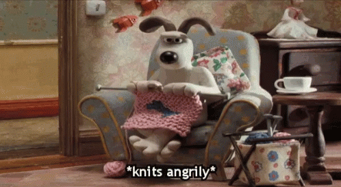
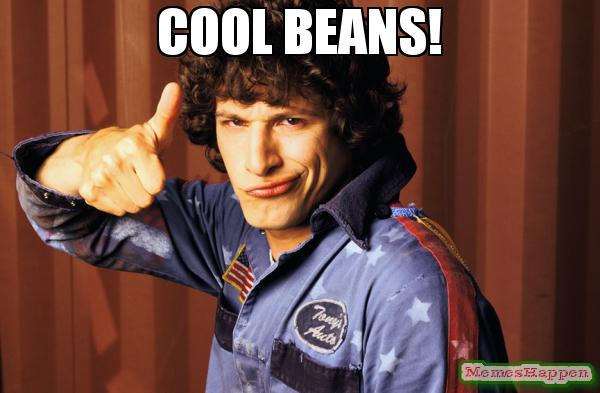
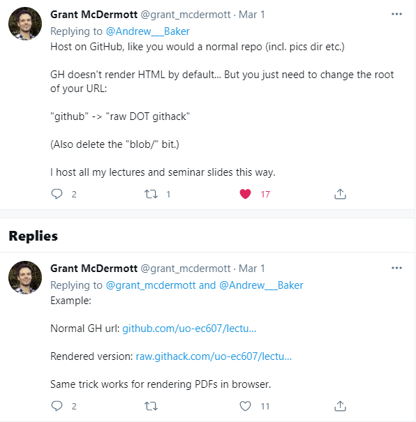

<!-- Usually, you should load all your packages at the beginning. If you don't have a package installed, you'll need to do that first! -->
```{r setup, warning=FALSE, message=FALSE, echo=FALSE}
library(emo)
library(stargazer)
library(tidyverse)
library(ggplot2)
```

# RMarkdown is awesome

It make take a bit more time, but the flexibility that Rmarkdown gives you (and the aesthetics `r emo::ji("heart_eyes")`) is unbeatable^[If you want to learn how to use emojis on your Rmarkdown files, go to https://github.com/hadley/emo]. This file is meant to act as a template and it includes some basic comments (both here and in the accompanying .css file, if you want to go to the HTML dark side), so it can be easily customized. 

Don't despair! You might start like this:

{width=3in}


But you will end up like this^[Note how we are changing the size of these figures (you can use different measures!)]:

{width=40%}

You can see the knitted version (PDF) of this file [here](https://www.magdalenabennett.com/files/Rmarkdown_template.pdf)

# Let's see some examples

## How does \LaTeX work in RMarkdown?

Well, it works pretty much the same as \LaTeX on its own (if you are familiar with it). Include inline equations like: $y_i = \beta_0 + \beta_1\cdot x_i + \varepsilon_i$, or equations on their own line:

$$y_i = \beta_0 + \beta_1 x_{i1} + \beta_2 x_{i2} + \beta_3 x_{i3} + \beta_4 x_{i4} + ... + \varepsilon_{i}$$

In this case `\beta` basically compiles as $\beta$, and the underscore creates a subindex, just like this: $\beta_0$. How can we do a superscript? Easy! `\theta^{ATE}`, which knits as $\theta^{ATE}$ (Note: Why do we use curly braces for this superscript? Try out what happens when you don't use those braces...)

The previous equation looks good, but sometimes they are too long to be included in one line. What to do? use `\\` to break lines within an equation. At the same time, you might want lines to be aligned at the equal sign. Here is how you do that:

$$\begin{aligned}
y_i =& \beta_0 + \beta_1 x_{i1} + \beta_2 x_{i2} + \beta_3 x_{i3} +\\
    &\beta_4 x_{i4} + ... + \varepsilon_{i}
\end{aligned}$$

(Note: Notice that the `&` sign denotes how the lines should be aligned).

---

## Let's code

We can write some simple code, if we want to show it (*Tip: Include `message=FALSE` and `warning=FALSE` so you don't get that extra stuff when you run the code*):

```{r lm-output, echo = TRUE, message=FALSE, warning=FALSE}
data(cars)

lm(speed ~ dist, data = cars)

```

Meh, but that output looks ugly. Can we make it prettier? Let's try `stargazer` (you will need to include the `results='asis'` argument).

```{r stargazer-one-model, echo = FALSE, message=FALSE, warning=FALSE, results='asis', align='center'}
data(cars)

lm1 <- lm(speed ~ dist, data = cars)

# You need to include "header = FALSE" to avoid an ugly output message.
# table.placement = "H" indicates that the table should be positions exactly were you put it in your document
stargazer(lm1,  title = "Regression of Speed on Distance", column.labels = c("Model 1"), header=FALSE,
          dep.var.caption = "Dependent Variable: Speed", dep.var.labels = "", table.placement = "H") 

```

You can also compare more than one model:

```{r stargazer-two-models, echo = FALSE, message=FALSE, warning=FALSE, results='asis', align='center'}

lm2 <- lm(speed ~ dist + I(dist^2), data = cars)

# You need to include "header = FALSE" to avoid an ugly output message.
stargazer(lm1, lm2,  title = "Two Regressions of Speed on Distance", column.labels = c("Model 1", "Model 2"), header=FALSE,
          dep.var.caption = "Dependent Variable: Speed", dep.var.labels = "",
          covariate.labels = c("distance","distance$^2$", "Constant"), table.placement = "H") 

```

---

# Let's plot

Finally, let's briefly look into plots. Play around with this syntax to customize it however you want!


```{r speed1, out.width='70%', fig.align='center', fig.cap='This is my first plot', echo=FALSE, message=FALSE, fig.pos="H"}
ggplot(data = cars, aes(x = dist, y = speed)) +
  geom_point(pch = 21, fill="light grey", color = "white", size = 5) +
  geom_smooth(aes(color = "#BF3984"), method="lm", se = TRUE, fill="#BF3984", lwd=2) + #I'm customizing colors, but you can also use something like "red" or "blue"
  scale_color_manual(values = c("#BF3984"), labels = "Linear fit") +
  xlab("Distance") + ylab("Speed") + ggtitle("Need for speed")+
  theme_bw() +
  theme(plot.margin=unit(c(1,1,1.5,1.2),"cm"),
      panel.grid.major.x = element_blank(), #Eliminate grid (comment these out if you want a grid)
      panel.grid.minor.x = element_blank(),
      panel.grid.major.y = element_blank(),
      panel.grid.minor.y = element_blank(),
      axis.line = element_line(colour = "dark grey"))+
  theme(axis.title.x = element_text(size=11),
      axis.text.x = element_blank(),
      axis.title.y = element_text(size=11),
      axis.text.y = element_blank(),legend.position=c(0.8,0.1),
      legend.title = element_blank(),
      legend.text = element_text(size=10),
      legend.background = element_rect(fill=NULL,colour ="white"),
      title = element_text(size=12))

```

... and for Andrew Baker's sake, we can also rotate the y-axis label (remember to rename your code chunk!)

```{r speed2, fig.dim=c(4.5,3.5), fig.align='center', fig.cap='This is my second plot', echo=FALSE, message=FALSE, fig.pos="H"}
ggplot(data = cars, aes(x = dist, y = speed)) +
  geom_point(pch = 21, fill="light grey", color = "white", size = 5) +
  geom_smooth(aes(color = "#BF3984"), method="lm", se = TRUE, fill="#BF3984", lwd=2) +
  scale_color_manual(values = c("#BF3984"), labels = "Linear fit") +
  xlab("Distance") + ylab("Speed") + ggtitle("Need for speed")+
  theme_bw() +
  theme(plot.margin=unit(c(1,1,1.5,1.2),"cm"),
      panel.grid.major.x = element_blank(), #Eliminate grid (comment these out if you want a grid)
      panel.grid.minor.x = element_blank(),
      panel.grid.major.y = element_blank(),
      panel.grid.minor.y = element_blank(),
      axis.line = element_line(colour = "dark grey"))+
  theme(axis.title.x = element_text(size=11),
      axis.text.x = element_blank(),
      axis.title.y = element_text(size=11, angle=0), #You can rotate the title with angle
      axis.text.y = element_blank(),legend.position=c(0.8,0.1),
      legend.title = element_blank(),
      legend.text = element_text(size=10),
      legend.background = element_rect(fill=alpha("white",0),colour ="white"),
      title = element_text(size=12))

```

---

# Come to the dark [HTML] side...

If you want to see how this would look as HTML, just change your YAML (i.e. the header of this document, between --- and ---) for the following:

```
---
title: "RMarkdown Template" # You can put the title of your document here
author: 
  - Nina West  # You can include names here
  - Trixie Mattel
  - Chi Chi Devayne
date: "August 16th, 2021"
output: 
  html_document:
    css: style.css 
    toc: no
---
```

I've included a separate [R markdown file]() with this^[Note that if you want to use CSS styles, you'll need to include the style.css file in the same directory as your .Rmd file], that you can knit and see how the HTML file looks. I've also uploaded it [here](https://www.magdalenabennett.com/files/Rmarkdown_template.html) just for fun `r emo::ji("partying_face")`.

If you want to share your HTML files, a super quick way is [Grant McDermottt's](https://twitter.com/grant_mcdermott) suggestion using Github:

{width=50%}